---
---
---

# Uso de *softwares* estatísticos

## *Softwares* "no-code" e "low-code"

## R para análise estatística

Dr. Hércules Freitas, Ph.D.$^1$

$^1$Universidade Federal do Rio de Janeiro (UFRJ), Centro de Ciências da Saúde, Instituto de Bioquímica Leopoldo de Meis, Laboratório de Erros Inatos do Metabolismo, Rio de Janeiro/RJ, Brasil.

### Aprendendo a programar

Aprender a programar, especialmente em uma linguagem como R, destinada à ciência de dados, é uma jornada empolgante, mas também repleta de desafios. Um dos maiores obstáculos que os iniciantes enfrentam não é a complexidade dos conceitos ou a sintaxe da linguagem, mas a frustração que surge ao encontrar erros e *bugs*. Este sentimento, embora desagradável, é uma parte integral do processo de aprendizado. A chave para superar essa frustração não está em evitá-la, mas em aprender a lidar com ela de maneira produtiva.

#### A importância de lidar com a frustração

A frustração, embora desconfortável, é um sinal de que você está se desafiando e saindo da sua zona de conforto. É um indicativo de crescimento e aprendizado. Quando você se depara com um erro em seu código R, é fácil sentir-se desanimado ou questionar suas habilidades. No entanto, é crucial reconhecer que até os programadores mais experientes enfrentam erros e *bugs* regularmente. A diferença está em como eles reagem a esses contratempos.

Uma habilidade subestimada na programação é a capacidade de ler e interpretar mensagens de erro. Em R, como em muitas outras linguagens de programação, as mensagens de erro são projetadas para guiar o programador na identificação e correção de problemas. Embora possam parecer crípticas no início, com a prática, você começará a reconhecer padrões comuns e entender melhor o que essas mensagens estão tentando comunicar. Abaixo, seguem algumas dicas para lidar com as dificuldades no aprendizado inicial:

1.  **Aceitação**: aceite que a frustração é uma parte normal do processo de aprendizado. Reconheça seus sentimentos, mas não permita que eles dominem sua motivação para aprender;

2.  **Pausas estratégicas**: quando se sentir sobrecarregado, faça uma pausa. Distanciar-se temporariamente do problema pode ajudar a clarear sua mente e trazer novas perspectivas;

3.  **Comunidade e suporte**: não hesite em buscar ajuda. A comunidade R é vasta e acolhedora, com fóruns e grupos dedicados a ajudar programadores de todos os níveis. Compartilhar suas dificuldades e buscar conselhos pode ser incrivelmente útil;

4.  **Prática e persistência**: a prática contínua é fundamental. Quanto mais você se expõe a diferentes problemas e erros, mais equipado estará para lidar com eles no futuro;

5.  **Celebre pequenas vitórias**: cada erro corrigido é um passo à frente em sua jornada de aprendizado. Celebre essas conquistas e reconheça seu progresso.

Aprender a programar em R é uma jornada valiosa que abre portas para o mundo da análise de dados. Embora a frustração seja uma parte inevitável desse processo, adotar uma abordagem positiva e resiliente pode transformar esses desafios em oportunidades de aprendizado. Lembre-se, cada erro é uma chance de crescer, e cada problema resolvido é um passo em direção à maestria na programação. Mantenha-se motivado, pratique regularmente e, mais importante, seja paciente consigo mesmo. O caminho para se tornar proficiente em R pode ser longo, mas é, sem dúvida, recompensador.

### Visão geral do R e suas aplicações

R é uma linguagem de programação e um ambiente de software para análise estatística e gráfica. A história do R remonta à década de 1970 com o desenvolvimento da linguagem S no Bell Labs por John Chambers e outros [@chambers1980]. A linguagem S foi projetada para ser uma linguagem de programação que fosse tanto eficiente quanto fácil de usar, com foco em análise de dados e gráficos estatísticos.

Na década de 1990, Ross Ihaka e Robert Gentleman, da Universidade de Auckland, na Nova Zelândia, iniciaram o desenvolvimento do R como um projeto de pesquisa. Eles foram influenciados pela linguagem S e pelo Scheme, uma linguagem de programação com semântica de escopo léxico. O R foi concebido como um dialeto da linguagem S, com a intenção de melhorar e ampliar a análise estatística e as capacidades gráficas [@ihaka1996].

R é uma linguagem de programação interpretada, o que significa que o código é executado diretamente, sem a necessidade de compilação prévia. Isso facilita a depuração e o desenvolvimento iterativo. Além disso, R é uma linguagem dinamicamente tipada, permitindo que os tipos de dados sejam alterados em tempo de execução.

Uma das principais características do R é a sua extensibilidade. A comunidade de usuários e desenvolvedores contribuiu com uma vasta coleção de pacotes que estendem a funcionalidade básica do R, disponíveis através do *Comprehensive R Archive Network (CRAN)* [@hornik2012]. Esses pacotes cobrem uma ampla gama de técnicas estatísticas, modelos gráficos, métodos de *machine learning*, e muito mais.

R também é conhecido por sua capacidade de produzir gráficos de alta qualidade, que são essenciais para a análise exploratória de dados e a apresentação de resultados estatísticos. A linguagem oferece diversas funções e pacotes para a criação de gráficos, incluindo o popular *ggplot2*, que permite a construção de gráficos complexos de maneira intuitiva [@wickham2011].

Outra característica importante do R é a sua comunidade ativa e colaborativa. Os usuários de R frequentemente compartilham seu código e experiências, ajudando uns aos outros a resolver problemas e a melhorar suas habilidades de programação. Isso é facilitado por fóruns de discussão, listas de e-mail e conferências.

As principais aplicações da linguagem R no mundo do trabalho abrangem uma vasta gama de setores, especialmente aqueles que dependem intensamente da análise de dados, estatística e modelagem preditiva. Profissões como cientistas de dados, analistas de mercado, pesquisadores em saúde e biologia, e especialistas em *machine learning* são apenas alguns exemplos de carreiras que se beneficiam diretamente do uso de R. Esta linguagem é particularmente valorizada por sua capacidade de manipular grandes conjuntos de dados, realizar análises estatísticas complexas, criar visualizações de dados avançadas e desenvolver modelos de *machine learning*.

No futuro, espera-se que a demanda por profissionais com habilidades em R continue a crescer, à medida que mais setores reconhecem a importância da tomada de decisões baseada em dados. Profissões emergentes, como especialistas em big data, analistas de cibersegurança que utilizam técnicas de aprendizado de máquina para identificar ameaças, e profissionais envolvidos na criação e gestão de ambientes virtuais no metaverso, também poderão se beneficiar do uso de R.

Além disso, à medida que a inteligência artificial (IA) e a análise de dados se tornam cada vez mais integradas em diferentes aspectos do mundo do trabalho, a capacidade de utilizar R para desenvolver e implementar soluções baseadas em dados será uma habilidade altamente valorizada.

A linguagem R, com sua comunidade ativa e vasta coleção de pacotes, oferece uma plataforma robusta para inovação e desenvolvimento em diversas áreas. Profissionais do futuro poderão utilizar R para explorar novos territórios em ciência de dados, otimização de processos, desenvolvimento de produtos baseados em IA, análises ambientais e muito mais. A flexibilidade e a capacidade de adaptação de R a diferentes contextos e desafios tornam-na uma ferramenta valiosa para profissionais que buscam estar na vanguarda da inovação e da análise de dados.

### **Instalando o R e o RStudio** 

Para instalar o R e o RStudio em computadores com sistemas operacionais Windows ou Mac, siga os passos abaixo:  

#### Instalação do R no Windows: 

1.  Acesse o site do CRAN ([Comprehensive R Archive Network](https://cran.r-project.org)), que é uma rede de servidores que armazena versões atualizadas do R; 

2.  Em "*Download and Install R*", clique em “*Download R for Windows*”; 

    

3.  Clique em “*...install R for the first time*”;

    

4.  Clique em "*Download R x.x.x for Windows*", onde "x.x.x" é o número da versão mais recente;

    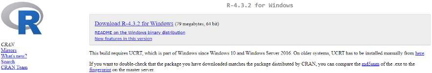

5.  Após o *download*, execute o arquivo baixado e siga as instruções do instalador. Durante a instalação, você pode aceitar as configurações padrão, que são adequadas para a maioria dos usuários.

#### Instalação do RStudio no Windows

1.  Após instalar o R, acesse o site do [RStudio (Posit)](https://posit.co/download/rstudio-desktop/);

2.  Desça a página e clique em "*Download RStudio Desktop for Windows*";

    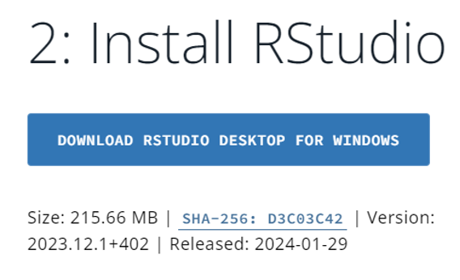{width="334"}

3.  Execute o arquivo baixado e siga as instruções para concluir a instalação.

#### Instalação do R no Mac

1.  Acesse o site do [CRAN](https://cran.r-project.org);

2.  Clique em "*Download R for macOS*";

    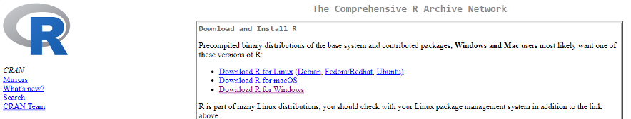

3.  Escolha a versão do R que deseja instalar (*Macbooks Intell, mais antigos, ou Macbooks M1/M2*);

    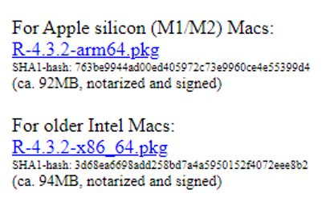{width="259"}

4.  Após o *download*, abra o arquivo ".pkg" baixado e siga as instruções para instalar o R.

#### Instalação do RStudio no Mac

1.  Visite o site do [RStudio (Posit)](https://posit.co/download/rstudio-desktop/) após instalar o R;

2.  Clique em "*Download RStudio*";

3.  Na seção *RStudio Desktop*, clique em "*Download RStudio Desktop for Mac*";

4.  Escolha a versão apropriada para Mac, seja para processadores Intel ou M1, e inicie o *download*;

5.  Abra o arquivo baixado e siga as instruções para instalar o RStudio.

Após a instalação, você estará pronto(a) para utilizar todas as funcionalidades do R no RStudio.

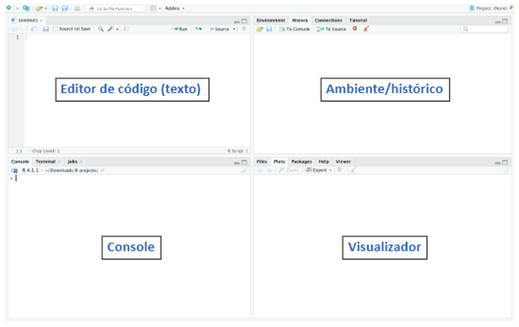{width="504"}

### Sintaxe básica e operações no R

#### Sintaxe básica

A sintaxe do R é bastante simples e direta. A linguagem faz distinção entre maiúsculas e minúsculas, portanto, "A" e "a" são considerados símbolos diferentes e podem se referir a variáveis diferentes. Os comandos no R são expressões ou atribuições. Se um comando é uma expressão, seu valor é calculado e visualizado, mas é perdido em seguida. Uma atribuição, por outro lado, calcula a expressão e atribui o resultado a uma variável, que é salva no ambiente de trabalho do R. Aqui está um exemplo de atribuição a variável no R ("x \<- 1" ou "x é igul a 1"):

**Passo 1**: digite o código desejado no editor

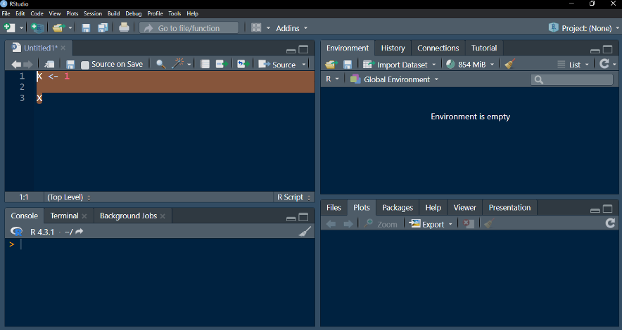

\* O código acima indica, na primeira linha, “X contém o valor 1”. A segunda linha “pede” ao programa que indique o valor de “X”.

**Passo 2**: selecione o código a ser executado e aperte "Ctrl + Enter"

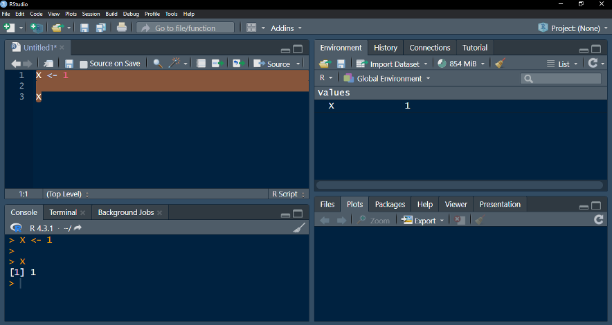

\*O resultado é apresentado no Console (i.e., "[1] 1" ou "X contém um valor, e esse valor é 1").

**Passo 3**: use o objeto X gerado em outros códigos

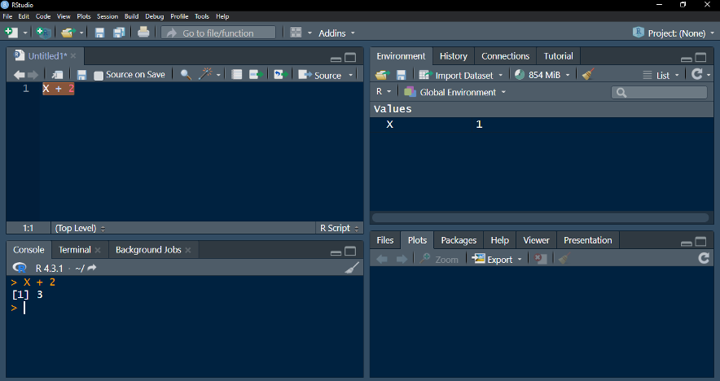

\*”X” é um objeto de valor 1. Se somado a 2, retorna o valor 3.

Agora, tente interagir com os exemplos abaixo:

1.  **Criação de vetores**: v \<- c(1, 2, 3, 4, 5)

2.  **Criação de matrizes**: m \<- matrix(1:9, nrow = 3, ncol = 3)

3.  **Criação de listas**: l \<- list(nome = "João", idade = 30, altura = 1.75)

4.  **Criação de data frames**: df \<- data.frame(nome = c("João", "Maria"), idade = c(30, 25))

**Exemplo**: produzindo um *data frame* (quadro de dados)

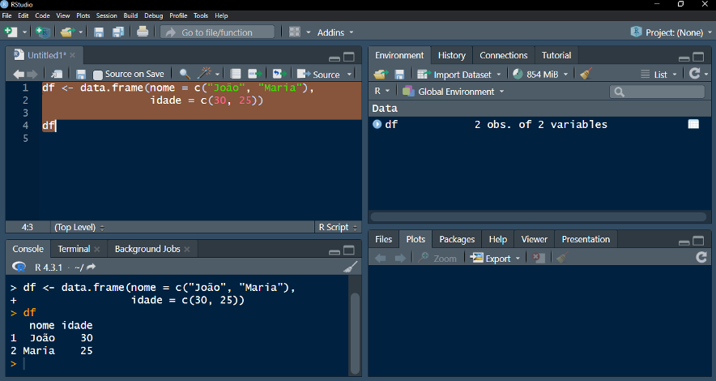

#### Operações básicas

O R pode ser usado como uma calculadora simples, realizando operações aritméticas básicas como adição (+), subtração (-), multiplicação (\*), divisão (/) e potenciação (\^). Além disso, o R também suporta operadores relacionais como menor (\<), menor ou igual (\<=), maior (\>), maior ou igual (\>=), igual (==) e diferente (!=).

Aqui estão alguns exemplos de operações básicas no R:

1.  **Adição**: "3 + 2" resulta em 5

2.  **Subtração**: "5 - 2" resulta em 3

3.  **Multiplicação**: "3 \* 2" resulta em 6

4.  **Divisão**: "6 / 2" resulta em 3

5.  **Potenciação**: "2 \^ 3" resulta em 8

Além disso, o R suporta operações com vetores e matrizes. Por exemplo, se você tem dois vetores de mesmo comprimento, pode somá-los diretamente: "c(1, 2, 3) + c(4, 5, 6)" resulta em "c(5, 7, 9)".

#### Manipulação de dados

O R também oferece uma variedade de funções para manipulação de dados. Por exemplo, você pode acessar elementos de um vetor usando o operador de colchetes ([]). Se você tem um vetor "x \<- c(1, 2, 3, 4, 5)", pode acessar o terceiro elemento com "x[3]", que resulta em 3.

Além disso, o R permite a manipulação de *strings*. Por exemplo, você pode criar duas variáveis que armazenam a primeira letra do seu primeiro e segundo nome, e então compará-las usando operadores lógicos.

Esses são apenas alguns exemplos da sintaxe básica e operações no R. A linguagem R é extremamente poderosa e flexível, permitindo uma ampla gama de manipulações de dados e análises estatísticas. Não se preocupe se encontrou erros ou se ainda não conseguiu utilizar todos os códigos de exemplo. Continue lendo o material do curso e praticando, é o melhor caminho para o aprendizado eficaz da linguagem R.

### Escrevendo código eficiente e legível

Escrever código eficiente e legível em R é fundamental para garantir a manutenção, compreensão e colaboração em projetos de programação. A linguagem R, amplamente utilizada em estatística e análise de dados, oferece diversas funcionalidades que, quando bem aproveitadas, podem melhorar significativamente a qualidade do código. Abaixo, apresentamos algumas recomendações práticas acompanhadas de exemplos para escrever um código mais limpo, eficiente e legível em R.

#### Convenções de nomenclatura

Utilize nomes significativos e autoexplicativos para variáveis e funções. Isso facilita a compreensão do propósito de cada componente do código:

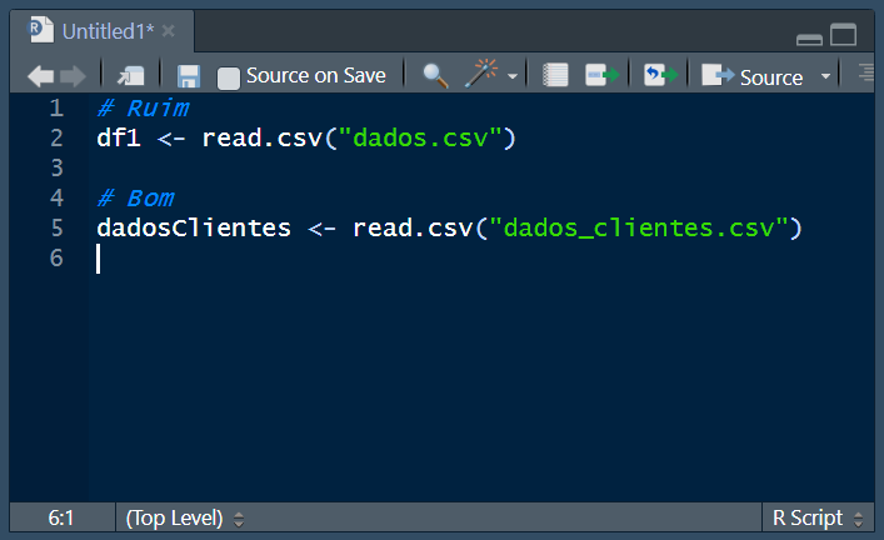

#### Formatação consistente

Mantenha um padrão de recuo, espaçamento e formatação. Isso torna o código mais organizado e fácil de ler:

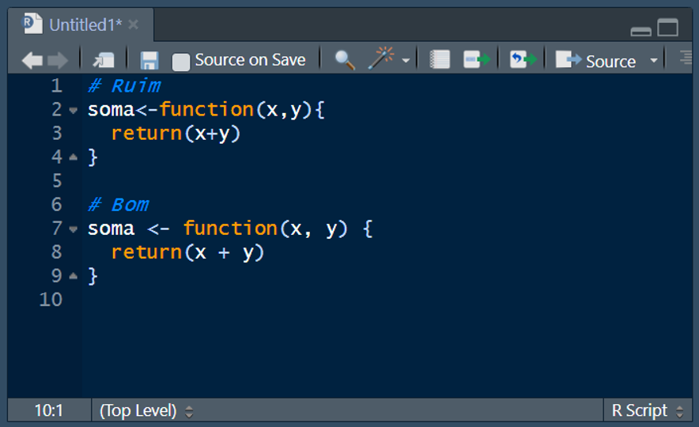

#### Comentários e documentação

Inclua comentários relevantes que expliquem o propósito e a funcionalidade do código. Evite comentários óbvios e mantenha-os atualizados:

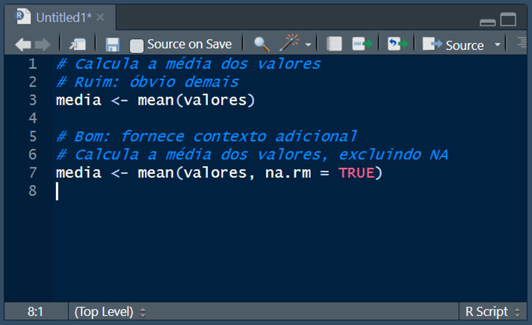

#### Simplicidade e modularidade

Evite complexidade desnecessária. Divida o código em funções e módulos pequenos e reutilizáveis:

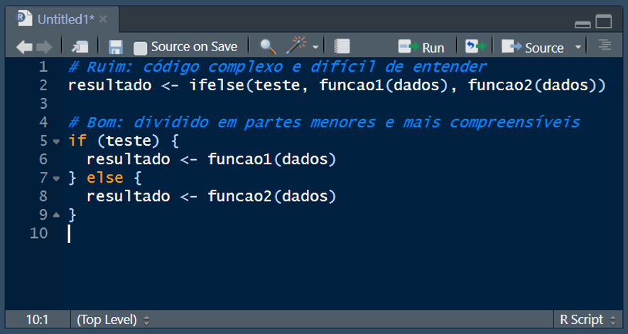

#### Tratamento de erros

Manipule e documente adequadamente quaisquer condições de erro para evitar falhas inesperadas:

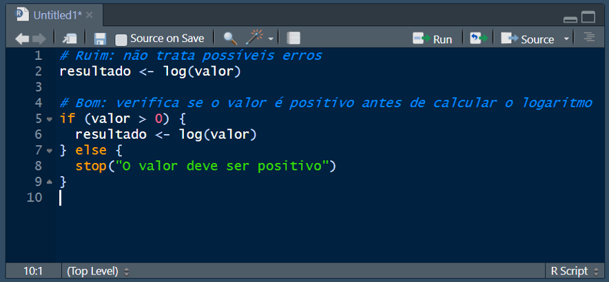

#### Evitar duplicações de código

Reutilize trechos de código e crie funções ou classes para evitar repetições desnecessárias:

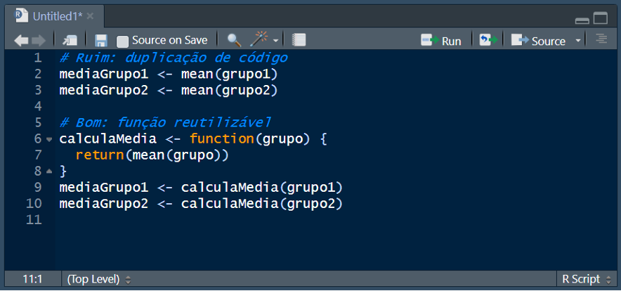

#### Vetorização

R é uma linguagem vetorizada, o que significa que muitas operações podem ser realizadas sem o uso explícito de *loops*, tornando o código mais eficiente:

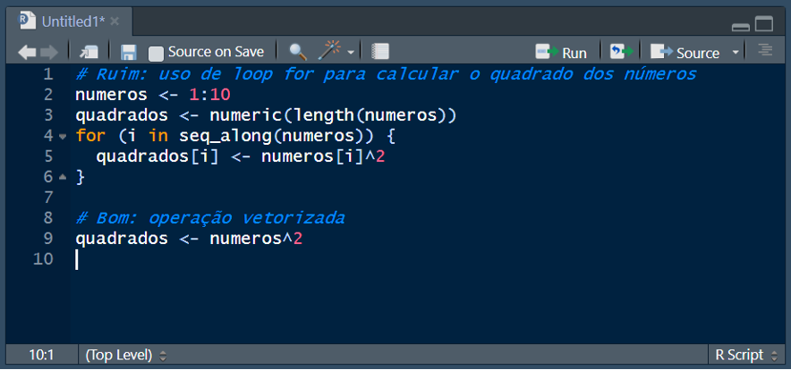

Seguindo essas práticas, é possível escrever código em R que não apenas atenda aos requisitos funcionais, mas também seja fácil de ler, entender e manter. A chave é sempre buscar a clareza, a simplicidade e a eficiência, facilitando assim o trabalho tanto do autor do código quanto de outros desenvolvedores que possam trabalhar com ele no futuro.

### Depuração e tratamento de erros em R

Escrever código que funcione corretamente é apenas uma parte do desenvolvimento de software; a outra parte é garantir que o código continue funcionando e que possa ser corrigido quando surgirem problemas. A depuração e o tratamento de erros são habilidades essenciais para qualquer programador, e na linguagem R não é diferente. Abaixo estão algumas estratégias e ferramentas para depuração e tratamento de erros em R, acompanhadas de exemplos práticos.

#### Depuração interativa

A depuração interativa permite que você inspecione o estado do seu programa R enquanto ele está sendo executado. O RStudio oferece ferramentas integradas para isso, como o inspetor de erros e a função "traceback( )", que lista a sequência de chamadas que levaram ao erro. Além disso, o RStudio possui ferramentas como "Rerun" with "Debug" e "options(error = browser())", que abrem uma sessão interativa onde o erro ocorreu.

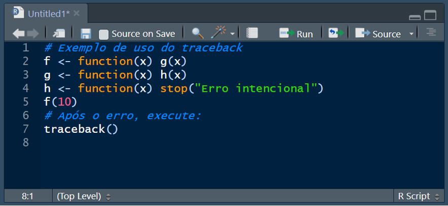

#### Tratamento de erros com tryCatch

A função "tryCatch()" é a principal ferramenta para lidar com erros e avisos em R. Ela permite que você especifique funções manipuladoras que controlam o que acontece quando uma condição é sinalizada.

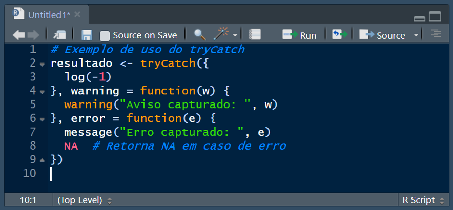

#### Logging de erros

Registrar erros é uma prática padrão no desenvolvimento de software. Em R, você pode usar pacotes de *logging* ou simplesmente registrar erros em um arquivo JSON ou em um banco de dados. Isso é especialmente útil em aplicativos de produção, como aplicativos shiny ou APIs REST.

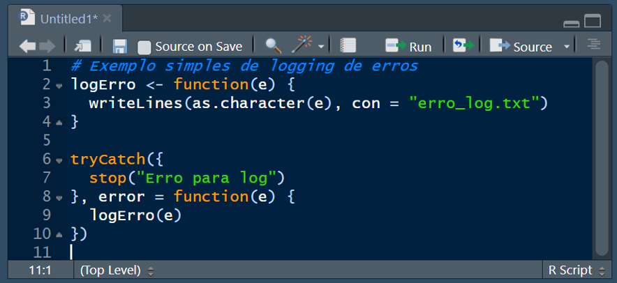

#### Debugging com print

Se as ferramentas de depuração não ajudarem, uma boa alternativa é o "print debugging", onde você insere vários comandos "print()" para localizar precisamente o problema e ver os valores das variáveis importantes. É um método lento e primitivo, mas sempre funciona.

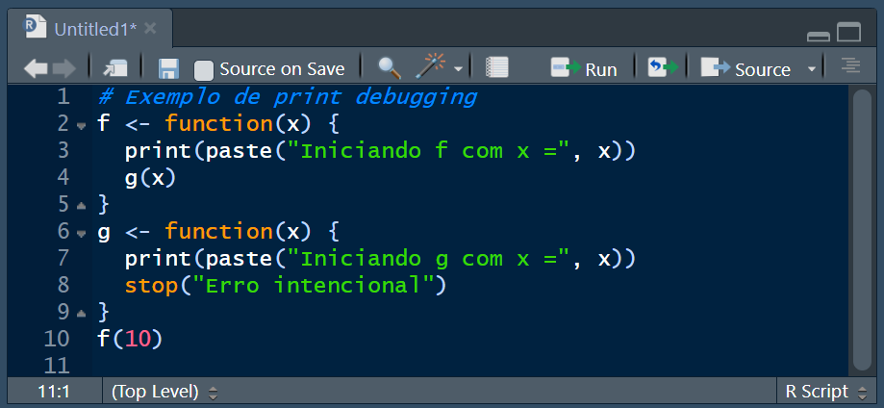

A depuração e o tratamento de erros são partes cruciais do desenvolvimento em R. Utilizar as ferramentas e estratégias corretas pode economizar tempo e evitar a perda de dados ou resultados importantes. É essencial criar mensagens de erro claras e informativas e documentar o significado dos erros que seu software pode gerar. A experiência e a prática levarão a uma maior maestria na depuração e no tratamento de erros em R.

### Documentando e compartilhando seu código

Documentar e compartilhar seu código são práticas essenciais para qualquer programador, especialmente para iniciantes em programação que estão aprendendo a linguagem R. Essas práticas não apenas facilitam a colaboração e a revisão por outros, mas também ajudam o próprio autor a entender e manter seu código ao longo do tempo.

#### Documentação de código

A documentação é a primeira linha de comunicação entre o programador e quem vai ler o código depois, seja o próprio autor em um momento futuro ou outros programadores. Em R, a documentação pode ser feita diretamente no código, usando comentários, e de forma mais estruturada, usando pacotes como o "roxygen2" [@wickham2024], que permite criar uma documentação que pode ser convertida em um manual de ajuda para o pacote.

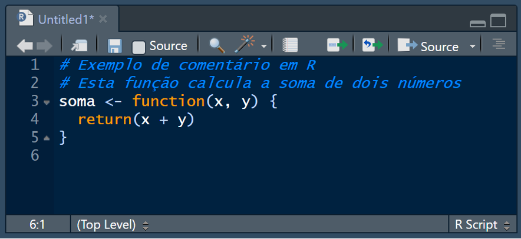

#### Compartilhamento de código

O compartilhamento de código em R pode ser feito de várias maneiras. Uma das mais comuns é através de scripts, que são arquivos de texto com extensão ".R". Esses scripts podem ser compartilhados por e-mail, repositórios de código como GitHub ou plataformas como [RPubs](https://rpubs.com), onde é possível publicar análises e códigos para que outros possam ver e usar.

#### R Markdown

Uma ferramenta poderosa para documentar e compartilhar análises em R é o R Markdown [@baumer2015]. Com ele, é possível combinar texto narrativo com código R que pode ser executado para gerar resultados, que são automaticamente incluídos no documento. Isso é particularmente útil para relatórios, onde a análise e os resultados precisam ser apresentados de forma clara e reproduzível.

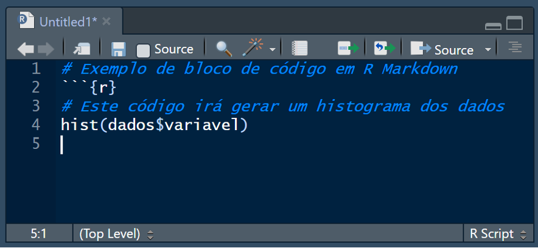

### Introdução à análise estatística com R

A análise estatística é uma parte fundamental da linguagem de programação R, que foi originalmente desenvolvida com um forte foco em estatística e análise de dados. Aqui está uma introdução detalhada à análise estatística com R.

R é uma linguagem de programação e um ambiente de software para análise estatística e gráficos. Ele fornece uma ampla variedade de técnicas estatísticas, incluindo regressão linear e não linear, análise de séries temporais, classificação, agrupamento e muito mais. Além disso, R é altamente extensível através de pacotes, que são bibliotecas de funções desenvolvidas pela comunidade para estender a funcionalidade do R.

#### Estatística Descritiva

A estatística descritiva é a primeira etapa na análise de dados. Ela envolve resumir e organizar os dados de maneira que possam ser facilmente compreendidos. As funções básicas do R para estatística descritiva incluem "mean()" para calcular a média, "median()" para a mediana, "sd()" para o desvio padrão, "var()" para a variância, "min()" e "max()" para os valores mínimo e máximo, respectivamente, e "summary()" para obter um resumo estatístico dos dados. As funções mencionadas acima já foram exemplificadas no módulo 2. Tente aplicar essas funções em um novo exemplo (ex.: vet1 \<- c(1,4,8,3,4,6,7,8,2,6,8,9,2,1,)).

#### Visualização de dados

A visualização de dados é uma parte importante da análise estatística. R fornece várias ferramentas para criar gráficos e visualizações de dados. As funções básicas incluem "plot()" para criar gráficos de dispersão, "hist()" para histogramas, "boxplot()" para boxplots e "barplot()" para gráficos de barras. Além disso, o pacote "ggplot2" oferece uma poderosa e flexível estrutura para criar gráficos complexos. O pacote "ggplot2" será explorado em mais detalhes no próximo módulo.

**Exemplo**: usando a função “plot( )”

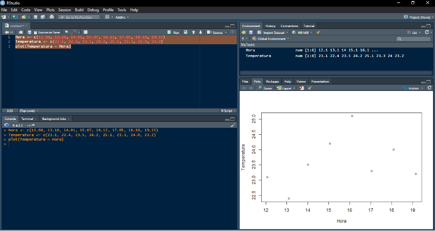

\*Dois vetores, “Hora” e “Temperatura”, foram criados e depois inseridos na função “plot( )”. Note que a sintaxe da função foi “plot(Temperatura \~ Hora)”, que é o equivalente de dizer “Temperatura em função da Hora” em linguagem R. O mesmo resultado pode ser obtido informando qual vetor ocupa qual eixo: “plot(x = Hora, y = Temperatura)”.

**Exemplo**: criando um histograma com a função “hist( )”

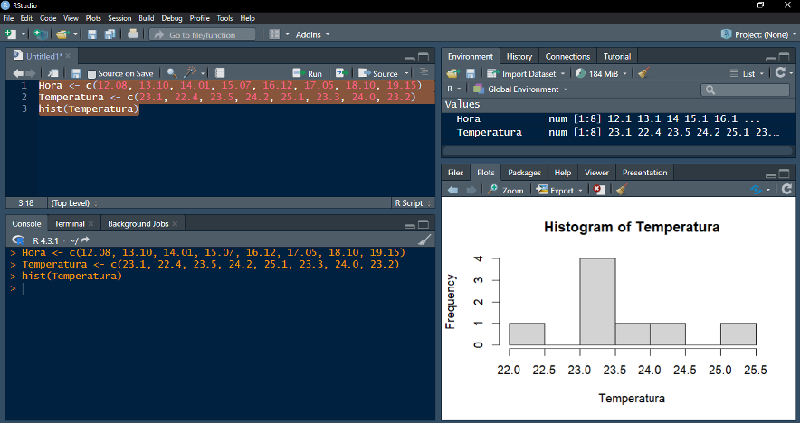

\*Utilizando o vetor “Temperatura” do exemplo anterior, criou-se um histograma com a função “hist( )”. Note como temperaturas entre 23,0 e 23,5 ºC são mais comuns do que as outras medidas ao longo do intervalo de tempo avaliado.

**Exemplo**: criando um boxplot com a função “boxplot( )”

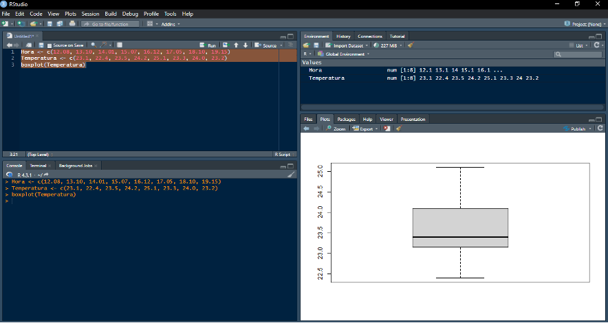

\*Utilizando a mesma estratégia do exemplo anterior, um diagrama de caixa (*boxplot*) foi criado através da função “boxplot( )”. Se desejar, leia mais sobre [como interpretar um *boxplot*](https://statplace.com.br/blog/como-interpretar-um-boxplot/), e pratique com novos exercícios.

#### Estatística inferencial

A estatística inferencial é o processo de usar os dados de uma amostra para inferir propriedades da população. Isso envolve a realização de testes de hipóteses para determinar se um resultado observado é devido ao acaso ou a algum fator subjacente. As funções básicas do R para estatística inferencial incluem "t.test()" para o teste t, "chisq.test()" para o teste do qui-quadrado, "cor.test()" para o teste de correlação, e "lm()" para a regressão linear.

**Exemplo**: realizando um teste de hipóteses com dois vetores numéricos

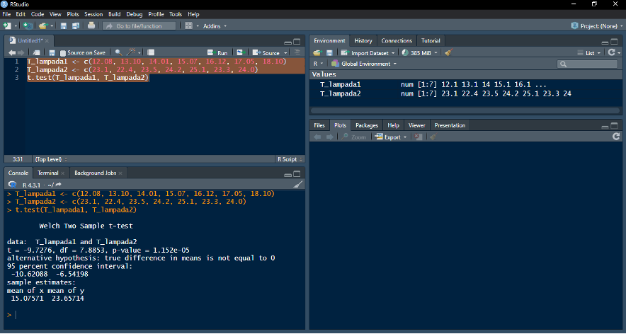

\*Suponhamos que as temperaturas superficiais de duas lâmpadas tenham sido medidas repetidas vezes. Agora, podemos comparar esses vetores numéricos (“T_lampada1” e “T_lampada2”) considerando a hipótese de que a diferença verdadeira entre as médias de ambos os vetores é igual a 0. Como se observa, a função “t.test( )” retorna uma probabilidade muito baixa (*p* = 0.00001152) de que os dois vetores tenham surgido de uma mesma distribuição. Em outras palavras, podemos atribuir confiança razoável de que ambas as lâmpadas possuam temperaturas médias distintas.

#### Modelagem estatística

A modelagem estatística é o processo de desenvolver um modelo matemático que descreve uma relação entre variáveis. R fornece várias funções para modelagem estatística, incluindo "lm()" para regressão linear, "glm()" para regressão linear generalizada, "anova()" para análise de variância, e "arima()" para modelagem de séries temporais.

**Exemplo**: avaliando a correlação entre dois vetores numéricos com a função “lm( )”

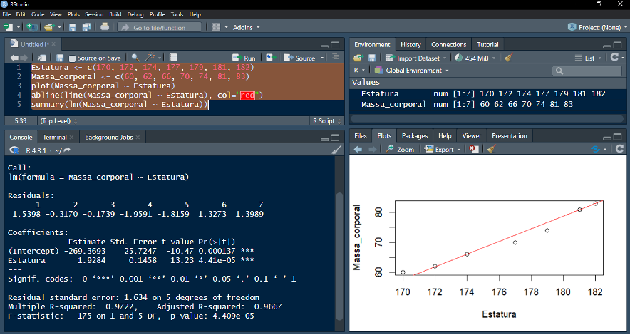

\*Dados de estatura e massa corporal de diversas pessoas foram armazenados em vetores numéricos. Um gráfico da relação entre as duas variáveis foi gerado com o código “plot(Massa_corporal \~ Estatura)”, seguido da linha vermelha “abline(line(Massa_corporal \~ Estatura), col="red")”. Como a relação entre estatura e massa corporal parecem proporcionais, a função “lm( )” foi utilizada para medir a associação entre os dois vetores. De acordo com o valor de R-quadrado (“*R-squared*”) da função “summary(lm(Massa_corporal \~ Estatura))”, 97 % da variação na massa corporal pode ser explicada pela variação observada na estatura. No exemplo, a função “summary( )” é usada para detalhar os resultados do modelo de regressão linear calculado pela função “lm( )”.

R é uma ferramenta poderosa para análise estatística, oferecendo uma ampla gama de funções para estatística descritiva, visualização de dados, estatística inferencial e modelagem estatística. Aprender a usar R para análise estatística pode abrir novas oportunidades para a exploração e compreensão de dados.

### Usando R para estatísticas descritivas

A linguagem de programação R é uma ferramenta poderosa para a realização de estatísticas descritivas, que são métodos utilizados para resumir e organizar um conjunto de dados de maneira que possam ser facilmente compreendidos. Abaixo, você encontrará uma explanação detalhada de como usar R para estatísticas descritivas. Exemplos dessas funções podem ser encontradas no módulo 2, mas é recomendado que você pratique os códigos deste módulo em seu ambiente RStudio.

#### Medidas de tendência central

As medidas de tendência central são estatísticas que indicam onde os dados estão centrados. As principais medidas de tendência central são a média, a mediana e a moda.

1.  **Média**: a média de um conjunto de dados é calculada somando todos os valores e dividindo pelo número de valores. No R, a média é calculada usando a função "mean()". Por exemplo, "mean(c(1, 2, 3, 4, 5))" calcula a média do vetor de números de 1 a 5.

2.  **Mediana**: a mediana é o valor que divide os dados ao meio quando estão ordenados. No R, a mediana é calculada usando a função "median()". Por exemplo, "median(c(1, 2, 3, 4, 5))" calcula a mediana do vetor de números de 1 a 5.

3.  **Moda**: a moda é o valor mais frequente em um conjunto de dados. R não tem uma função embutida para calcular a moda, mas pode ser calculada usando funções de outros pacotes ou escrevendo sua própria função.

#### Medidas de dispersão

As medidas de dispersão são estatísticas que indicam o quanto os dados estão espalhados. As principais medidas de dispersão são a variância, o desvio padrão e a amplitude.

1.  **Variância**: a variância é uma medida da dispersão que indica o quanto os valores se desviam da média. No R, a variância é calculada usando a função "var()". Por exemplo, "var(c(1, 2, 3, 4, 5))" calcula a variância do vetor de números de 1 a 5.

2.  **Desvio padrão**: o desvio padrão é a raiz quadrada da variância e fornece uma medida de dispersão que está na mesma unidade que os dados. No R, o desvio padrão é calculado usando a função "sd()". Por exemplo, "sd(c(1, 2, 3, 4, 5))" calcula o desvio padrão do vetor de números de 1 a 5.

3.  **Amplitude**: a amplitude é a diferença entre o maior e o menor valor em um conjunto de dados. No R, a amplitude pode ser calculada subtraindo o resultado da função "min()" do resultado da função "max()". Por exemplo, "max(c(1, 2, 3, 4, 5)) - min(c(1, 2, 3, 4, 5))" calcula a amplitude do vetor de números de 1 a 5.

#### Resumo dos dados

A função "summary()" no R fornece um resumo estatístico dos dados, incluindo a média, a mediana, o mínimo, o máximo, o primeiro quartil e o terceiro quartil. Por exemplo, "summary(c(1, 2, 3, 4, 5))" fornece um resumo do vetor de números de 1 a 5.

R é uma ferramenta poderosa para estatísticas descritivas, oferecendo uma ampla gama de funções para calcular medidas de tendência central, medidas de dispersão e resumos de dados. Aprender a usar R para estatísticas descritivas pode abrir novas oportunidades para a exploração e compreensão de dados.

### Estatísticas inferenciais com R

As estatísticas inferenciais com R envolvem o uso de técnicas estatísticas para fazer generalizações sobre uma população com base em uma amostra de dados. Essas técnicas são fundamentais para a tomada de decisões baseada em dados e para a pesquisa científica.

#### Conceitos básicos

Antes de realizar a inferência estatística, é importante entender alguns conceitos básicos, como população, amostra, parâmetro e estimativa. A população é o conjunto completo de observações que estão sendo estudadas, enquanto uma amostra é um subconjunto dessa população. Um parâmetro é uma medida resumida da população, como a média populacional, e uma estimativa é o correspondente calculado a partir da amostra.

#### Testes de hipóteses

Um dos pilares da inferência estatística é o teste de hipóteses. O objetivo é testar uma afirmação (hipótese) sobre um parâmetro populacional. No R, funções como "t.test()", "chisq.test()" e "anova()" são usadas para realizar diferentes tipos de testes de hipóteses.

Por exemplo, o "t.test()" é usado para comparar as médias de duas amostras e determinar se elas são significativamente diferentes. O teste do qui-quadrado ("chisq.test()") é frequentemente usado para testar a independência entre duas variáveis categóricas. A análise de variância (ANOVA), realizada através da função "anova()", é usada para comparar as médias de três ou mais grupos.

#### Intervalos de confiança

Outra ferramenta importante na inferência estatística é o intervalo de confiança, que fornece um intervalo estimado dentro do qual é provável que o parâmetro populacional esteja. No R, o "t.test()" e outras funções de teste fornecem intervalos de confiança como parte de seus resultados.

#### Regressão e correlação

A análise de regressão é usada para entender a relação entre variáveis. No R, a função "lm()" é usada para realizar regressão linear, que modela a relação entre uma variável dependente e uma ou mais variáveis independentes. A correlação, que mede a força e a direção da relação linear entre duas variáveis, pode ser calculada com a função "cor()".

#### Análise de séries temporais

A análise de séries temporais é um tipo de inferência estatística que lida com dados coletados ao longo do tempo. No R, funções como "ts()" para criar objetos de séries temporais e "arima()" para modelagem de séries temporais são usadas para analisar como os dados mudam ao longo do tempo.

**Exemplo**: utilizando a função “arima( )” para prever uma série temporal

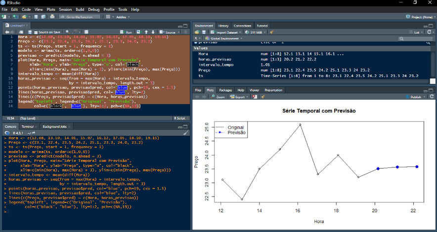

\*Utilizando os dados de tempo e variação do preço de uma determinada ação, podemos aplicar a função “arima( )” para criar um modelo e prever a variação de preço para as próximas 3 horas. Veja como o gráfico representa a série temporal original seguida de três pontos (azuis) informando a variação futura prevista.

A inferência estatística no R é uma área vasta e complexa, que requer um entendimento sólido de teoria estatística e a habilidade de aplicar essa teoria usando o R. As funções e pacotes disponíveis no R tornam a linguagem uma ferramenta poderosa para realizar análises inferenciais e extrair insights significativos de dados amostrais.

### Fundamentos da visualização de dados em R

A visualização é uma etapa crucial na análise de dados, pois permite aos analistas e cientistas de dados entender e interpretar os dados de maneira eficaz, além de comunicar suas descobertas de forma clara. No R, uma linguagem de programação amplamente utilizada para estatística e análise de dados, existem várias ferramentas e pacotes dedicados à visualização de dados. Aqui está uma explanação detalhada sobre os fundamentos da visualização de dados em R.

#### Gráficos base do R

O R possui um sistema de gráficos base que permite a criação de uma ampla variedade de gráficos, incluindo gráficos de linhas, barras, histogramas, boxplots, e scatter plots. Esses gráficos são gerados usando funções simples, como "plot()", "hist()", "barplot()", e "boxplot()". Por exemplo, a função "plot()" pode ser usada para criar gráficos de dispersão ou linhas, dependendo dos argumentos fornecidos. A função "hist()" é usada para criar histogramas, que são úteis para visualizar a distribuição de uma única variável numérica. Veja, abaixo, uma lista de gráficos comuns em *Base R*:

1.  **Gráficos de dispersão (scatter plots)**: utilizados para visualizar a relação entre duas variáveis numéricas. A função "plot()" é a mais comum para criar esses gráficos.

2.  **Histogramas**: usados para representar a distribuição de uma única variável numérica. A função "hist()" é utilizada para gerar histogramas.

3.  **Gráficos de linhas**: úteis para visualizar dados ao longo do tempo ou sequências ordenadas. A função "plot()" também pode ser usada para criar gráficos de linhas, alterando o tipo de ponto para uma linha.

4.  **Gráficos de barras**: permitem comparar quantidades entre diferentes grupos. As funções "barplot()" ou "hist()" podem ser usadas para criar gráficos de barras.

5.  **Boxplots**: fornecem uma representação visual da distribuição de uma variável numérica, destacando a mediana, os quartis e os valores discrepantes. A função "boxplot()" é usada para criar boxplots.

Vamos praticar um exemplo da função “barplot( )”.

**Exemplo**: criando um gráfico de barras com a função “barplot( )”

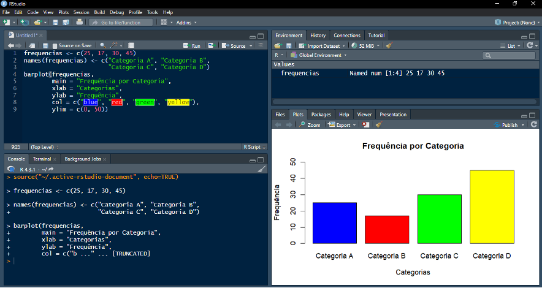

\*Considerando um vetor contendo a contagem de frequências para quatro categorias distintas (Categorias A, B, C e D), um gráfico de barras pode ser gerado com a função “barplot( )”. Também é possível personalizar diversos aspectos do gráfico dentro da função: “main” = título do gráfico; “xlab” = título do eixo x; “ylab” = título do eixo y; “col” = cor de preenchimento das barras; “ylim” = limites numéricos do eixo y.

#### Personalização de gráficos

Os gráficos base do R são altamente personalizáveis. Você pode modificar títulos, rótulos dos eixos, cores, tipos de linhas e pontos, e muito mais, usando argumentos adicionais nas funções de plotagem. Por exemplo, você pode usar o argumento "main" para adicionar um título ao gráfico, "xlab" e "ylab" para rótulos dos eixos X e Y, respectivamente, e "col" para alterar a cor dos pontos ou linhas.

Também é possível sobrepor elementos gráficos em R base. Por exemplo, você pode gerar uma linha que conecta todos os pontos em um gráfico de dispersão (“plot( )” + “lines( )”), ou até mesmo adicionar uma legenda para diferentes barras (“barplot( )” + “legend( )”).

**Exemplo**: sobrepondo elementos gráficos em R base

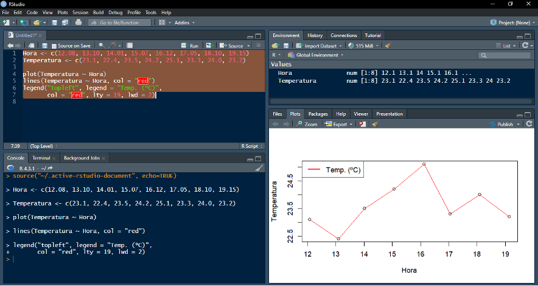

\*No exemplo acima, um gráfico de dispersão foi criado utilizando a função “plot( )”. Logo abaixo, uma função “lines( )” cria uma linha vermelha que conecta todos os pontos do gráfico. Finalmente, a função “legend( )” permite a criação de uma legenda para os dados.

#### O pacote ggplot2

Além do sistema de gráficos base, o R oferece o pacote "ggplot2" (lembre-se que pacotes devem ser instalados no primeiro uso e importados sempre que utilizados em uma nova sessão), que é baseado nos princípios da "Gramática dos Gráficos". O "ggplot2" permite a construção de gráficos complexos de maneira incremental, adicionando camadas de elementos gráficos. Um gráfico no "ggplot2" começa com a função "ggplot()", à qual são adicionadas camadas usando o operador "+". Por exemplo, você pode começar definindo os dados e as estéticas ("aes") e, em seguida, adicionar uma camada para o tipo de gráfico (como "geom_point()" para um scatter plot ou "geom_histogram()" para um histograma).

**Exemplo**: criando um gráfico básico com a função “ggplot( )”

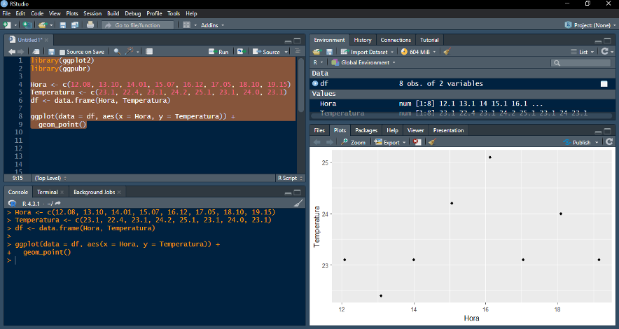

\*Primeiro, os pacotes desejados foram importados para o ambiente R. No caso do exemplo acima, “ggplot2” é o pacote necessário para gerar gráficos, enquanto “ggpubr” será utilizado para manipular a apresentação do gráfico no próximo exemplo. Antes de criar o gráfico, um data frame (“df”) foi gerado a partir dos vetores “Hora” e “Temperatura”. Depois, um objeto ggplot é criado utilizando a função “ggplot(data = df, aes(x = Hora, y = Temperatura))”; para adicionar os pontos ao gráfico, porém, é necessário adicionar um “+” ao lado da função e, em seguida, informar a função para o tipo de gráfico. No caso do exemplo, a função “geom_point( )” cria um gráfico de dispersão simples.

Múltiplos gráficos "ggplot" podem ser organizados em uma mesma figura. Uma forma de fazê-lo é com o pacote "ggpubr". A função "ggarrange()" no R é uma ferramenta flexível do pacote "ggpubr" que permite organizar múltiplos gráficos "ggplot" em uma única página, com a capacidade de especificar o número de colunas e linhas, bem como criar uma legenda comum para vários gráficos.

Por exemplo, se você tiver três gráficos diferentes armazenados nas variáveis "bxp", "dp" e "dens", você pode organizá-los em uma grade de 2 colunas e 2 linhas usando "ggarrange(bxp, dp, dens, ncol = 2, nrow = 2)". Além disso, se você deseja usar uma legenda comum para múltiplos gráficos que compartilham as mesmas estéticas, como cor ou forma, você pode fazer isso com "ggarrange(bxp, dp, common.legend = TRUE)", onde "bxp" e "dp" são dois gráficos que você deseja combinar. Isso é particularmente útil quando você tem várias visualizações dos mesmos dados e quer evitar a repetição de legendas, tornando o resultado mais limpo e fácil de ler.

**Exemplo**: organizando mais de um gráfico por tela com “ggarrange( )”

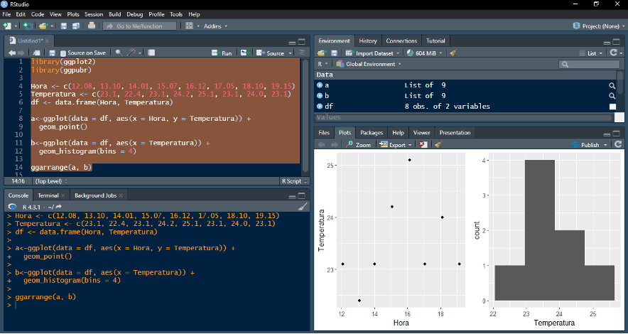

\*Utilizando uma continuação do exemplo anterior, um novo gráfico foi criado (“geom_histogram( )”). Depois, atribuiu-se o primeiro gráfico à variável “a” e o segundo à variável “b”. Finalmente, bastou informar à função “ggarrage( )” quais gráficos devem ser organizados no mesmo plano. Tente inverter a ordem dos objetos na função “ggarrange” (ex.: “ggarrange(b, a)”).

#### Visualização de dados multivariados

Tanto o sistema de gráficos base quanto o "ggplot2" oferecem opções para visualizar dados multivariados. Por exemplo, você pode usar cores, formas ou tamanhos de pontos para representar variáveis adicionais em um scatter plot. No "ggplot2", isso é feito especificando estéticas adicionais dentro da função "aes()".

A facetação é uma técnica poderosa no "ggplot2" que permite dividir os dados em subconjuntos e plotar cada subconjunto em seu próprio painel dentro do gráfico. Isso é útil para comparar subgrupos de dados. A facetação pode ser realizada usando as funções "facet_wrap()" ou "facet_grid()".

**Exemplo**: utilizando “facet_grid( )” para facetar um gráfico em seus segmentos

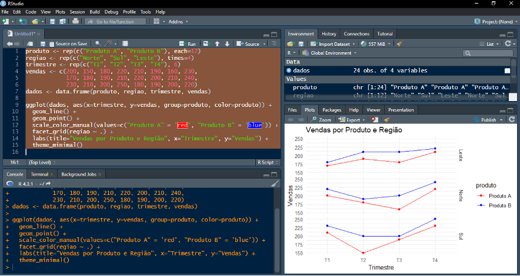

\*O código do exemplo acima cria um conjunto de dados e um gráfico correspondente. Primeiramente, são criadas quatro variáveis: "produto", que repete os nomes "Produto A" e "Produto B" doze vezes cada; "regiao", que repete os nomes "Norte", "Sul" e "Leste" quatro vezes cada; "trimestre", que repete os trimestres "T1", "T2", "T3" e "T4" seis vezes; e "vendas", que contém uma série de valores representando as vendas. Essas variáveis são combinadas em um "data.frame" chamado "dados". Em seguida, utiliza-se o ggplot2 para criar um gráfico de linhas com pontos, onde o eixo x representa os trimestres, o eixo y as vendas, as linhas e pontos são agrupados e coloridos de acordo com o produto, e o gráfico é dividido em painéis por região utilizando a função “facet_grid( )”. Além disso, são definidas cores manuais para os produtos, adicionados títulos aos eixos e ao gráfico, e aplicado um tema minimalista.

#### Extensões do ggplot2

Existem vários pacotes que estendem as capacidades do "ggplot2", adicionando novos tipos de gráficos ou funcionalidades. Por exemplo, o pacote "ggplotly" permite converter gráficos "ggplot2" em gráficos interativos, e o "gganimate" permite criar animações a partir de gráficos "ggplot2".

**Exemplo**: criando um gráfico interativo a partir de um ggplot com “ggplotly( )”

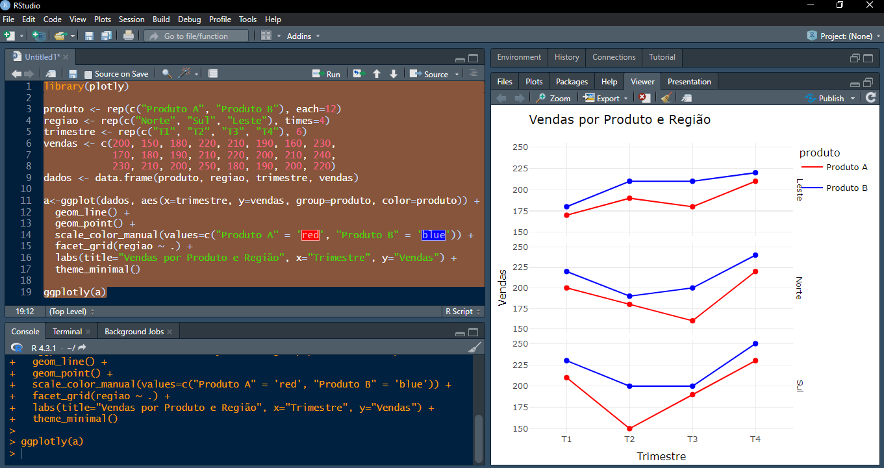

\*Baseado no código do exemplo anterior, foi possível elaborar um gráfico interativo em três simples passos: 1. Importar o pacote “plotly” utilizando “library(plotly)”; 2. Atribuir o ggplot previamente criado a uma variável “a” (basta inserir “a \<- “ logo antes do início do código para o gráfico; 3. Fornecer o objeto “a” à função “ggplotly( )”. O gráfico gerado, apesar de similar ao anterior, se torna interativo e permite funções como zoom, salvar como figura, etiqueta dinâmica de dados e outras.

A visualização de dados em R é uma área rica e flexível, com muitas opções disponíveis para o analista. Seja usando o sistema de gráficos base para gráficos simples e rápidos ou explorando a profundidade e flexibilidade do "ggplot2" para gráficos mais complexos e polidos, o R oferece ferramentas poderosas para transformar dados brutos em insights visuais compreensíveis.

#### Visualização de dados geoespaciais

A visualização de dados geoespaciais é outra técnica avançada que pode ser realizada em R, utilizando pacotes como "ggplot2" em conjunto com "sf" [@pebesma2024] para criar mapas detalhados. Esses mapas podem representar desde a distribuição geográfica de eventos até análises espaciais complexas, como clusters ou padrões de movimento.

**Exemplo**: criando um mapa a partir de dados geoespaciais com o pacote “sf”

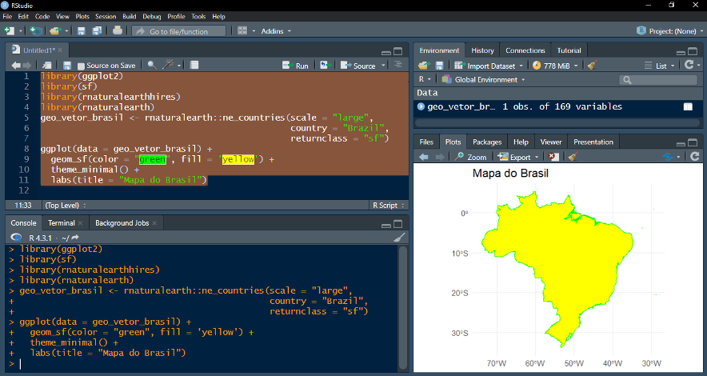

\*O código do exemplo acima utiliza as bibliotecas "ggplot2", "sf" e "rnaturalearth" para criar um mapa do Brasil. A função "ne_countries" do pacote "rnaturalearth" é usada para obter os dados geográficos do Brasil, especificando que queremos os dados em uma escala grande e que o formato de retorno seja um objeto "sf", que é um padrão para trabalhar com dados espaciais no R. O objeto "geo_vetor_brasil" contém esses dados e é passado para a função "ggplot", que inicia a construção do gráfico. A função "geom_sf" é utilizada para adicionar os dados espaciais ao gráfico, com a cor das linhas definida como verde e o preenchimento como amarelo, representando as fronteiras e o interior do país, respectivamente. O tema "theme_minimal" é aplicado para um visual limpo e a função "labs" adiciona um título ao gráfico. O resultado é um mapa do Brasil com fronteiras destacadas em verde e interior em amarelo.

#### Animações com gganimate

O pacote "gganimate" [@pedersen2024] estende as capacidades do "ggplot2", permitindo criar animações a partir de gráficos. Isso pode ser particularmente útil para visualizar mudanças nos dados ao longo do tempo, como tendências econômicas, padrões climáticos ou o progresso de uma epidemia.

**Exemplo**: criando um gráfico animado com o pacote “gganimate”

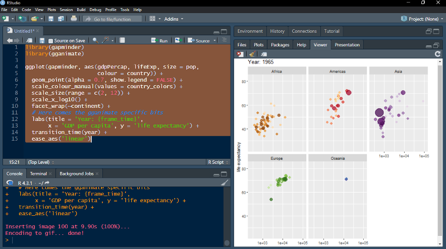

\*No exemplo acima, foram utilizadas as bibliotecas "gapminder"[@bryan2023] e "gganimate" para criar uma animação que mostra a relação entre o PIB per capita (GDP per capita), a expectativa de vida (life expectancy) e o tamanho da população (pop) de diferentes países ao longo do tempo. A função "ggplot" inicia a construção do gráfico com os dados do "gapminder", e a função "aes" define as variáveis para os eixos x e y, o tamanho dos pontos e a cor de acordo com o país. "geom_point" adiciona pontos ao gráfico com uma transparência de 0.7 e sem legenda. "scale_colour_manual" permite a personalização das cores dos pontos por país, enquanto "scale_size" ajusta o intervalo de tamanho dos pontos. "scale_x_log10" transforma o eixo x em uma escala logarítmica para melhor visualização dos dados. "facet_wrap" divide o gráfico por continente. As funções específicas do "gganimate", como "transition_time" e "ease_aes", são usadas para criar a animação ao longo do tempo, definida pela variável "year", e para suavizar a transição entre os frames. O título do gráfico é atualizado dinamicamente para mostrar o ano correspondente a cada frame da animação. Veja a animação [clicando aqui](https://gganimate.com/reference/figures/README-unnamed-chunk-4-1.gif).

#### Dashboards interativos com Shiny

O pacote "shiny" [@chang2024] permite criar aplicativos web interativos diretamente em R. Esses dashboards podem incluir uma variedade de elementos de entrada e saída, permitindo aos usuários interagir com os dados e visualizações em tempo real. Shiny é uma ferramenta poderosa para a construção de ferramentas analíticas interativas e personalizadas.

**Exemplo**: aplicação shiny para metanálises criada em RStudio

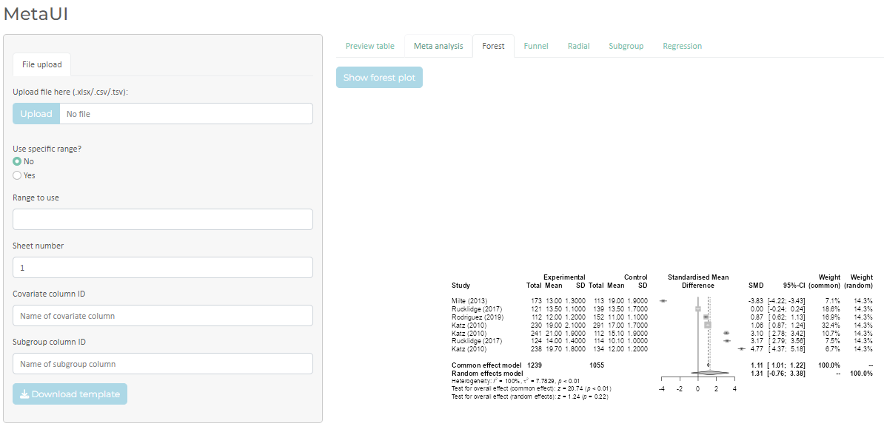

\*A produção de aplicações e *dashboards shiny* é um processo mais complexo do que os exemplos vistos anteriormente. Sua utilização, porém, permite a criação de ferramentas especializadas para pesquisa, trabalho e negócios. Depois de criadas, essas aplicações podem poupar muitas horas de trabalho de um analista ou até mesmo permitir que pessoas sem o conhecimento de programação possam realizar as análises necessárias.

#### Tabelas e quadros em R

Para criar tabelas no R, podemos usar a função "table()" para tabular dados e a função "view()" para visualizar data frames em formato de tabela. Uma forma de visualizar seus dados sem a utilização da função “view( )” é clicar no ícone de uma tabela ou uma lupa:

que aparecem na aba “Environment” da janela superior direita. Além disso, o pacote "knitr" [@xieaut2024] oferece a função "kable()", que cria tabelas formatadas para relatórios e documentos.

**Exemplo**: criando uma tabela com a função “kable( )”

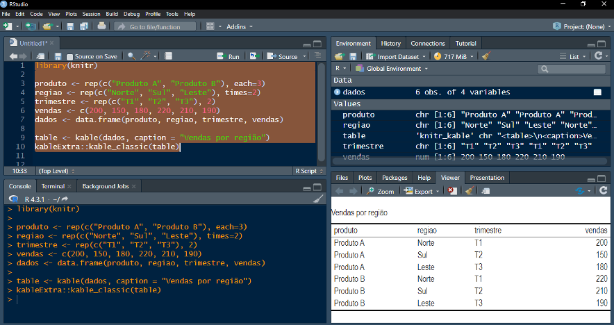

\*Utilizando dados modificados do exemplo anterior, uma tabela kable foi criada. Primeiro, o pacote “knitr” foi importado para o ambiente. Em seguida, criou-se um objeto “table” com a função “kable( )” que recebeu o data frame “dados”. Finalmente, fornecendo o objeto “table” à função “kable_classic( )” (não é necessário utilizar “kableExtra::” antes da função), foi possível criar uma tabela.

## Python para análise estatística

## Visualização de dados e figuras científicas
