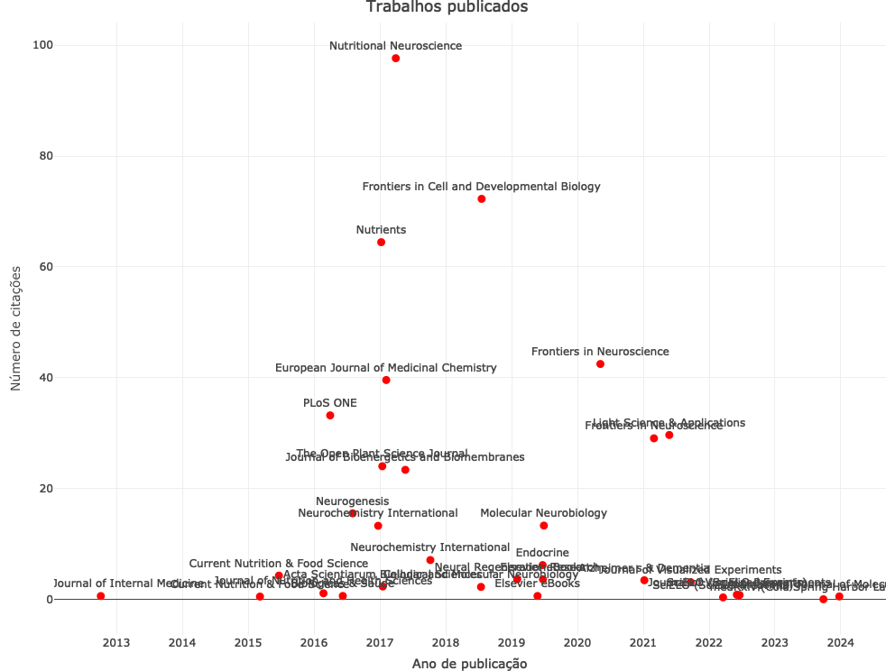

# Sobre o projeto

**O editor**

Professor Hércules é Licenciado em Ciências, Licenciado em Matemática, Bacharel em Biologia e Nutrição; Especialista em Fitoterapia e em Farmacologia; Possui MBA em Big Data, além de Mestrado e Doutorado em Biofísica pela Universidade Federal do Rio de Janeiro (UFRJ), com grau pela Universidade de Coimbra. Foi contemplado com bolsas de pesquisa da Coordenação de Aperfeiçoamento de Pessoal de Nível Superior (CAPES), do Conselho Nacional de Desenvolvimento Científico e Tecnológico (CNPq), do National Institutes of Health (NIH) e da Tess Research Foundation (TRF). É autor do livro Princípios de Bioética e coautor dos livros Neurociência da Mente e do Comportamento e Omega Fatty Acids in Brain and Neurological Health. Atua como revisor de periódicos internacionais, como o British Journal of Pharmacology, Frontiers in Neuroscience, Neurochemical Research, BMJ Open, PLOS One e Food Research International. Participa do corpo editorial da revista Neuroenergetics, Nutrition and Brain Health (Frontiers) e é consultor ad hoc de projetos submetidos ao Natural Sciences and Engineering Research Council of Canada (NSERC). Realizou estágio pós-doutoral em Neuropatologia na Universidade da Califórnia (Davis), sob supervisão do Dr. Lee-Way Jin e da Dra. Izumi Maezawa. Atualmente, está vinculado do Laboratório de Erros Inatos do Metabolismo, Instituto de Bioquímica Médica Leopoldo de Meis, Universidade Federal do Rio de Janeiro (UFRJ).

<br />

*Produção científica*

<br />

```{r echo=FALSE, message=FALSE, warning=FALSE}

#install.packages("openalexR")

library(openalexR)
library(dplyr)
library(tidyverse)
library(plotly)
library(readr)
library(ggrepel)

# Set the mailto option for polite pool access
options(openalexR.mailto = "hfreitasphd@gmail.com")

work <- oa_fetch(entity = "authors", identifier = "a5009519051", verbose = TRUE)

works_from_orcids <- oa_fetch(
  entity = "works",
  author.orcid = c("0000-0003-1584-9157", "https://orcid.org/0000-0003-1584-9157"),
  verbose = TRUE
)

# Ensure necessary columns exist and filter the data
filtered_data <- works_from_orcids %>%
  select(doi, cited_by_count, publication_date, title, so) %>%
  mutate(
    publication_year = as.numeric(substr(publication_date, 1, 4))
  ) %>%
  filter(!is.na(cited_by_count) & !is.na(publication_year) & !is.na(doi) & !is.na(title) & !is.na(so))

# Add jitter to the data points
filtered_data <- filtered_data %>%
  mutate(
    jittered_year = publication_year + runif(n(), -0.5, 0.5),  # Jitter for x-axis
    jittered_citations = cited_by_count + runif(n(), -0.1, 0.8),   # Jitter for y-axis
    label_offset_x = jittered_year + runif(n(), -100, 100),    # Offset labels near jittered x
    label_offset_y = jittered_citations + runif(n(), -50, 50)    # Offset labels near jittered y
  )

# Create the interactive plot with jittered points
plotly_plot <- plot_ly(
  data = filtered_data,
  x = ~jittered_year,
  y = ~jittered_citations,
  type = "scatter",
  mode = "markers+text",
  marker = list(size = 9, color = "red"),
  text = ~so,  # Add journal name as the label
  textposition = "top center",  # Initial label position
  hoverinfo = "text",
  textfont = list(size = 12),
  hovertext = ~paste(
    "Title:", title,
    "<br>Journal:", so,
    "<br>Citations:", cited_by_count,
    "<br>DOI:", doi
  ),
  customdata = ~doi
) %>%
  layout(
    title = "Trabalhos publicados",
    xaxis = list(
      title = "Ano de publicação",
      tickmode = "linear",
      dtick = 1  # Ensure only integer years are displayed
    ),
    yaxis = list(title = "Número de citações")
  ) %>%
  htmlwidgets::onRender("
    function(el, x) {
      el.on('plotly_click', function(d) {
        var url = d.points[0].customdata;
        window.open(url, '_blank');  // Open the DOI link in a new tab
      });
    }
  ")

# Display the plot
plotly_plot

```

```{r static-image, eval = !knitr::is_html_output(), echo=FALSE}

library(webshot)
library(htmlwidgets)

# Save the Plotly chart as an HTML file (hidden output)
saveWidget(plotly_plot, "plot.html")

# # # Capture a screenshot and save it as a PNG
# webshot("plot.html", file = "plot.png")

# # # Include the image in the PDF
# 
```

<br />

**Metodologia científica e Bioestatística**

O projeto "Metodologia científica e Bioestatística" é colaborativo e de acesso aberto. O objetivo é que o documento seja sempre atualizado e que seus autores sejam reconhecidos por suas contribuições.
